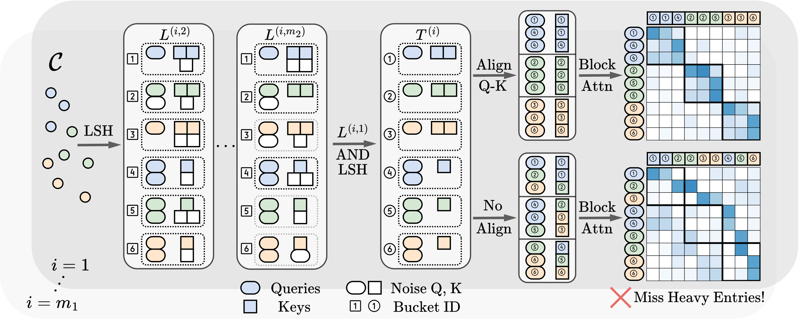

<h1 align="center">LSH-Based Efficient Point Transformer (HEPT)</h1>
<p align="center">
    <a href="https://arxiv.org/abs/2402.12535"></a>
    <a href="https://github.com/Graph-COM/HEPT"></a>
</p>

## TODO
- [ ] Put more details in the README.
- [ ] Add support for FlashAttn.
- [ ] Modify the example code to have the same naming convention as mentioned in the paper.
- [x] Add support for efficient processing of batched input.
- [x] Add an example of HEPT with minimal code.

## News
- **2024.04:** HEPT now supports efficient processing of batched input by this [commit](https://github.com/Graph-COM/HEPT/commit/2e408388a16400050c0eb4c4f7390c3c24078dee). This is implemented via integrating batch indices in the computation of AND hash codes, which is more efficient than naive padding, especially for batches with imbalanced point cloud sizes. **Note:** The current implementation for batched input is not yet fully tested. Please feel free to open an issue if you encounter any problems.

- **2024.04:** An example of HEPT with minimal code is added in `./example` by this [commit](https://github.com/Graph-COM/HEPT/commit/350a9863d7757e556177c52a44bac2aaf0c6dde8). It's a good starting point for users who want to use HEPT in their own projects. There are minor differences between the example and the original implementation in `./src/models/attention/hept.py`, but they should not affect the performance of the model.


## Introduction
This study introduces a novel transformer model optimized for large-scale point cloud processing in scientific domains such as high-energy physics (HEP) and astrophysics. Addressing the limitations of graph neural networks and standard transformers, our model integrates local inductive bias and achieves near-linear complexity with hardware-friendly regular operations. One contribution of this work is the quantitative analysis of the error-complexity tradeoff of various sparsification techniques for building efficient transformers. Our findings highlight the superiority of using locality-sensitive hashing (LSH), especially OR \& AND-construction LSH, in kernel approximation for large-scale point cloud data with local inductive bias. Based on this finding, we propose LSH-based Efficient Point Transformer (**HEPT**), which combines E2LSH with OR \& AND constructions and is built upon regular computations. HEPT demonstrates remarkable performance in two critical yet time-consuming HEP tasks, significantly outperforming existing GNNs and transformers in accuracy and computational speed, marking a significant advancement in geometric deep learning and large-scale scientific data processing.

<p align="center"></p>
<p align="center"><em>Figure 1.</em>Pipline of HEPT.</p>

## Datasets
All the datasets can be downloaded and processed automatically by running the scripts in `./src/datasets`, i.e.,
```
cd ./src/datasets
python pileup.py
python tracking.py -d tracking-6k
python tracking.py -d tracking-60k
```

## Installation

#### Environment
We are using `torch 2.0.1` and `pyg 2.4.0` with `python 3.10.0` and `cuda 11.8`.

#### Running the code
To run the code, you can use the following command:
```
python tracking_trainer.py -m hept
```

Or
```
python pileup_trainer.py -m hept
```
Configurations will be loaded from those located in `./configs/` directory.

## FAQ

#### How to tune the hyperparameters of HEPT?
There are three key hyperparameters in HEPT:
- `block_size`: block size for attention computation
- `n_hashes`: the number of hash tables, i.e., OR LSH
-  `num_regions`: # of regions HEPT will randomly divide the input space into (Sec. 4.3 in the paper)

We suggest first determine `block_size` and `n_hashes` according to the computational budget, but generally `n_hashes` should be greater than 1. `num_regions` should be tuned according to the local inductive bias of the dataset.


## Reference
```bibtex
@article{miao2024hept,
  title   = {Locality-Sensitive Hashing-Based Efficient Point Transformer with Applications in High-Energy Physics},
  author  = {Miao, Siqi and Lu, Zhiyuan and Liu, Mia and Duarte, Javier and Li, Pan},
  journal = {arXiv preprint arXiv:2402.12535},
  year    = {2024}
}
